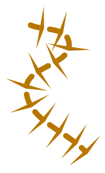

# Technical Insights When Writing Draw To SVG

Things I found out while writing the convertor.

## Beyond the documentation - The obscure corners of the Draw file format

* Each object type is stored in a four byte word, but it's really only two bytes long, or occasionally one :unamused:. 

	The standard Draw object types from Acorn lie in the range 0-16, easily fitting within the first byte. Third party applications have used either the top two bytes or in some cases the top three bytes for other purposes like layer numbers etc, some of which may or may not need to be masked off to get the actual object type. Officially and empirically, the most compatible way to treat the object type is as a two byte value (Some files use object types from 0x100 upwards for new object types, and these need to be recognised as new object types). But I have also included a command line option to treat it as a one byte value for the occasional file that requires it. See [here](https://www.riscosopen.org/forum/forums/11/topics/1556) for discussion on this point.

* Font names in the font table also accept font identifiers like "\Ffont\Ealphabet". See [here](https://riscosopen.org/forum/forums/4/topics/3903) for discussion on this point.

* Paths. Dashed lines render the start and end caps *for each dash*. So for example, if you have a triangular end cap style there will be a triangle on each dash. 

* Matrix transformations. The Transformed text, transformed sprite and JPEG objects each take a transformation matrix. I decompose the matrix into separate translation, rotation, scale and skew components and use these to create the SVG output. Note that the change of coordinate system between Draw and SVG (including translations, scale and reflection) means you can't just use the matrix form unmodified. Even if the matrix is transformed to the new coordinate space (including the required reflection) any text will be reflected too!.

* Transformed text objects can be underlined (but it's buggy in !Draw). Text area objects can underline of course, but there is an undocumented font flag (bit 2) which is supposed to underline transformed text. There is an example Draw file in the Draw source code repository [here](https://gitlab.riscosopen.org/RiscOS/Sources/Apps/Draw/-/blob/master/Test/Underline,aff).

* Sprites. RISC OS sprites are a complete mess of a format. They have lots of caveats, exceptions, and logical gymnastics making the code a lot more complicated than it would ideally need to be. This is partly due to backwards compatibility: A new generation of sprites are hacked onto the previous generation of sprites, then rinse and repeat.

* Groups. Objects can be grouped together with this object type, but groups have no transformation matrix, so there's no hierarchy of transformations going on in Draw.

* Tagged object. The idea is that if a 3rd party application has a fancy new object type, they can use a tagged object as a fallback mechanism to render something using a standard object type stored within a tagged object even in applications that don't support the new object type. I think the documentation implies the tagged object stores only one regular draw object, but this could be a group object holding more objects internally of course. It also stores binary data for the 3rd party application to keep track of the tagged object, which should be ignored. I've never seen one in the wild though.

* Text Area objects. Formatted text, with obscure formatting rules and limitations. The documentation tries, but is not specific enough. The only definitive source of for the actual rules is the source code of !Draw itself. These are the rules I endeavour to follow in my convertor.

* If writing a RISC OS based conversion tool, be aware that the Draw file renderer is close, but subtly different from the !Draw renderer (See [here](http://www.riscos.com/support/developers/prm/drawfile.html)).

* For the purposes fo Draw to SVG conversion, most of the Options object isn't needed. I only use the paper size and landscape/portrait orientation.

* !Draw has a limited range of dash patterns available in its UI, but third party applications can create different dash patterns.

* The 'text background colour hint' is really just a limitation of the RISC OS font anti-aliasing system that is not needed on modern systems.

## The SVG file format

SVG can handle pretty much anything Draw can do, with a bit of work.

* SVG 1.1 features are still generally better supported across a wider range of renderers than fancy SVG 2 features. By 'renderers' here I mean anything that reads and interprets SVG files (such as web browsers, SVG viewers, and SVG importers). In general finding the most compatible incantations of SVG code that work on a wide variety of SVG renderers requires many rounds of testing across different renderers.

* There are one or two basic SVG verifiers out there, to make sure the SVG you have written is valid, but I was hoping for better.

* SVG doesn't have good support for rendering formatted text in multiple fonts (even in SVG 2), so Text Area objects need to be written as individual runs of text positioned carefully piece by piece. \<tspans\> are not supported consistently well by SVG renderers. Using \<tspans\> is optional in my convertor. Obviously text has a different width depending on the font that is used to render it, so I measure the text in the first available font from the font stack to estimate the actual width that will be used when rendered. This may be an approximation to reality, but is the best that can be done, and seems to work ok in practice. Using commonly available fonts in the font stacks helps. The font stacks are configurable in my convertor.

* SVG paths only draw start and end caps at the end of the path, not for each dash, so I calculate the correct position and orientation of each cap for each dash and draw them separately, and group them with the path.

* SVG files can *embed* PNG and JPG images (among other formats) using base64 encoding. This increases the file size a little, but that's not usually a problem on modern machines, the files sizes are all still modest. This is preferable to linking to separate files since (a) separate image files can get misfiled/lost, and (b) there are security concerns/restrictions that discourage/prevent using external images in SVGs. See [SVG Security](https://www.w3.org/wiki/SVG_Security) and [Secure Static Mode](https://www.w3.org/TR/SVG/conform.html#secure-static-mode).

## Fonts
See [here](fonts.md) for details.

## Links to other convertors
| Link                                                      | Notes                                |
|:----------------------------------------------------------|:-------------------------------------|
| [pkg-draw2svg](https://ssjools.hopto.org/software/pkg-draw2svg)    | RISC OS only, doesn't convert images |
| [XP1Dr2SVG](https://clive.semmens.org.uk/RISCOS/XP1Dr2SVG.html) | RISC OS only, doesn't convert images |
| [dataconverters](https://github.com/tautology0/dataconverters)       | RISC OS, but basically plain C with a couple of RISC OS header files for constants. Doesn't handle transformed text or JPEGs. |
| [drawfile-render](https://github.com/dcf21/drawfile-render)           | Python. Doesn't handle path endcaps? Requires Cairo (cairocffi) package |
| [stardot forum topic](https://stardot.org.uk/forums/viewtopic.php?t=3936) | Windows only. Doesn't convert images etc. A 'Basic Draw File Converter' |

## Other Related tools
| Link                                                                          | Notes                                |
|:------------------------------------------------------------------------------|:-------------------------------------|
| [drawview](http://www.keelhaul.me.uk/acorn/drawview/)                              | 'DrawView' viewer application (Linux/Unix). |
| [Drawfile](https://www.boddie.org.uk/david/Projects/Python/Drawfile/index.html)    | Python. Allows reading and writing of Draw files into classes (but not writing to SVG). |
| [drawview](https://github.com/martenjj/drawview)                                   | C++. Requires Qt 5, KDE framework, and CMake/GNU autotools. Allows Draw files to be viewed on Linux/Unix systems. Export to SVG supported? |
| [Draw&nbsp;Plus](http://www.keelhaul.me.uk/acorn/)                                       | 'Draw Plus' editing application. |

## Example Draw files
If you are writing your own convertor, then you probably want some example Draw files for testing.

| Link                                                                          | Notes                                |
|:------------------------------------------------------------------------------|:-------------------------------------|
| [Examples.zip](assets/Examples.zip) | Some example files in a zip file, mostly my own. |
| [Test Examples](https://gitlab.riscosopen.org/RiscOS/Sources/Apps/Draw/-/tree/master/Test) | Examples in the RISC OS !Draw source code. |
| [Random Draw files](http://fileformats.archiveteam.org/wiki/Acorn_Draw) | Links to some random clip art. |

See also the RISC OS Open sources for the [!Draw source code](https://gitlab.riscosopen.org/RiscOS/Sources/Apps/Draw) (written in C).
