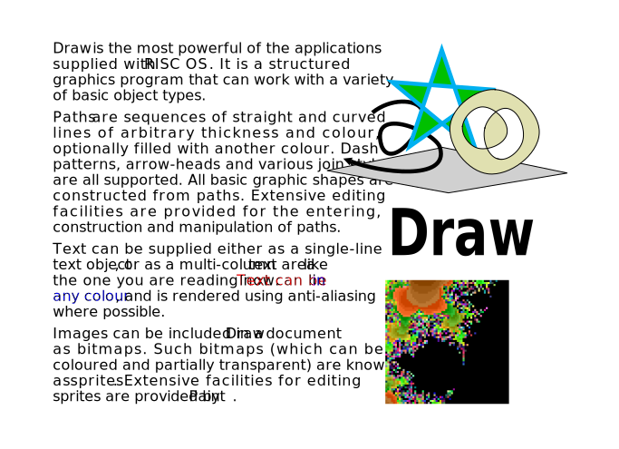
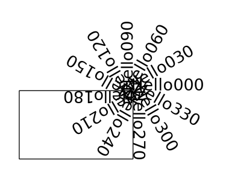
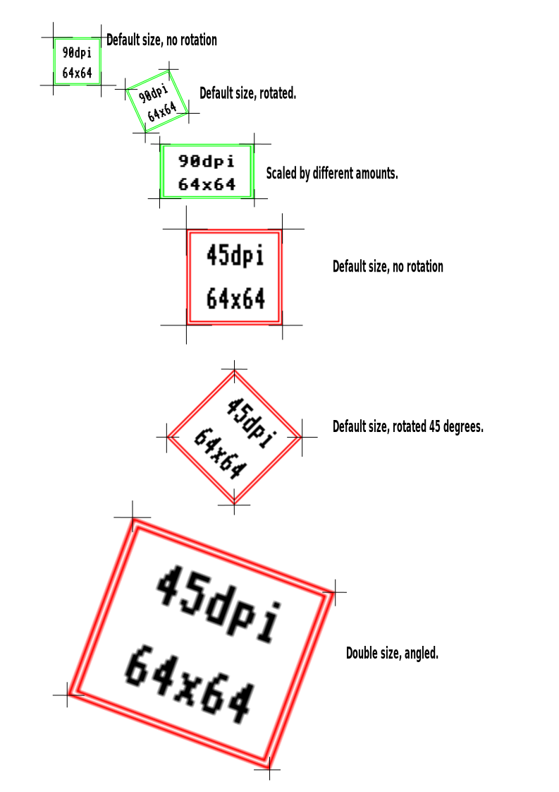

# Draw To SVG

## Introduction

*Draw To SVG* converts files from Acorn's *!Draw* application to SVG format. Here is an example Draw file converted to SVG:



It is a command line tool written in Python. It aims to be comprehensive and accurate, while still being easy to use. If you find issues, please let me know, preferably with an example Draw file so I can test it.

It handles all the standard objects found in !Draw.

+ **Fonts** RISC OS Fonts are translated to similar modern fonts. A default font stack is provided for each RISC OS font to give them a similar look. A  configuration file can customise the font stacks used if needed.

+ **Character Sets and Alphabets** Every character is translated to the UTF-8 standard. Particular attention is given to the standard RISC OS fonts (*Corpus*, *Homerton*, *Newhall*, *Swiss*, *Trinity*, *Sassoon*, *Selwyn*, *Sidney* and *System*). The exact glyphs in each font are translated to UTF-8 standard. Fonts with an explicit alphabet specified (using '\Ffont\Ealphabet' in the font table) are also correctly translated. See the [font tables](insights/fonts.md) to see all the glyphs.

+ **Regular Text** Text is positioned, sized, and spaced to match the the original text. Right to left text, reversed text and underlined text are all supported. Kerning is always applied. The !Draw UI doesn't support entering newlines in regular text objects, but they are respected here because other utilities that create Draw files can create them.

+ **Transformed Text** Full matrix transformation is supported, including scale, rotation, and skew.



+ **Text Area** Rich formatted text: Text is split into newspaper-like columns. Paragraphs, leadings, margins, left, right, centre and full justification, font changes, text colours, underlines, vertical moves (for super/subscript) are all supported.

+ **Paths** All path commands are supported, including straight and Bezier curves with colour, thickness, and fill colour. All start and end cap combinations are supported, including caps on the ends of each dash along dashed lines. Triangle caps width/length is supported. Join styles are supported. Winding rules (which can affect the area filled) are also supported.

+ **Sprites** All RISC OS sprite data is decoded, then converted to PNG data and embedded within the SVG file.

+ **Transformed Sprite** Full matrix transformation is supported, including scale, rotation, and skew.



+ **JPEG** Full matrix transformation is supported, including scale, rotation, and skew. JPEG data is embedded in the SVG.

+ **Groups** Are converted to SVG groups.

+ **Tagged** I've not seen a draw file use this in the wild, but I've written some code that should work in theory (*crosses fingers*).

+ **Options** All page sizes are supported, in portrait or landscape.

## Requirements
The tool is written in Python 3. The only dependency is the [Python Image Library ('Pillow')](https://pillow.readthedocs.io/en/latest/installation.html).

## Usage

### Command Line
```
usage: draw_to_svg.py <options>

Converts Acorn's Draw files to SVG.

options:
  --help                 show this help message and exit
  --dir <directory>      search recursively from <directory> for .draw files to convert (overrides --input and --output)
  --input INPUT          input draw filepath
  --output OUTPUT        output SVG filepath
  --utf8                 assume all text in the Draw file is already UTF8 encoded, no conversion needed
  --tspans               uses SVG <tspan>s to output text areas (but these are not well supported by SVG renderers)
  -v                     output verbosity level 1, which shows each filename as it's being processed
  -vv                    output verbosity level 2, which shows lots of debugging data as it's being processed
  --basic-underlines     use basic underlines (no colour or thickness) to help out Safari that can't cope
  --no-bbox              ignore the bounding box width when outputting text
  --fonts <ini-file>     fonts ini file listing the replacement font stacks
  --fit-border <amount>  Set SVG page size to match Draw content with a border amount in pixels or percentage (e.g. '50px' or '20%')
  --one-byte-types       Some applications use a one byte object type, as opposed to the default two byte value

For debugging the tool:
  --label-debug          add debugging labels to each object
  --show_boxes           for debugging purposes, show the bounding box for each object
```

### Python Module

If you want to use this convertor as part of a bigger Python program, you can. Assuming you have ```draw_to_svg/``` as a subdirectory of the current directory, here's an example of how you would use it:

```
from draw_to_svg import draw_to_svg as ds

# Set any settings as needed. These are the defaults:
ds.convertor.config.verbose_level       = 1
ds.convertor.config.utf8                = False
ds.convertor.config.use_tspans          = False
ds.convertor.config.show_debug_index    = False
ds.convertor.config.show_bounding_boxes = False
ds.convertor.config.basic_underlines    = False
ds.convertor.config.use_bbox            = True
ds.convertor.config.fonts_ini           = None
ds.convertor.config.fit_border          = False
ds.convertor.config.one_byte_types      = False

# Convert a file
ds.convertor.convert_to_svg("input.draw", "output.svg")
```

### Customising Font Stacks
You can provide an INI file with the font stacks of your choice, e.g.:

```
[main]
_default   = Arial,Helvetica,Verdana,sans-serif
Corpus     = Corpus,Courier New,Courier,Lucida Console,monospace
Homerton   = Homerton,Arial,Helvetica,Verdana,sans-serif
NewHall    = NewHall,Century,Century Schoolbook,serif
Swiss      = Swiss,Arial,Helvetica,Verdana,sans-serif
Trinity    = Trinity,TimesNewRoman,Times New Roman,Times,Times-Roman,Baskerville,Georgia,serif
Sassoon    = Sassoon,Lexend,Comic Sans MS,Comic Sans,sans-serif
Selwyn     = Selwyn,Zapf Dingbats,ZapfDingbats,sans-serif
Sidney     = Symbol,sans-serif
System     = System,VT323,Courier New,Courier,Lucida Console,monospace
WimpSymbol = WimpSymbol,Zapf Dingbats,ZapfDingbats,sans-serif
```

Use the command line ```--fonts``` option to specify the INI filepath.

## What I Learned

Find out [what I learned](insights/insights.md) about the format while writing this convertor.

## Limitations

* A small quirk of the !Draw renderer is that an underline does not change its vertical position when superscripts or subscripts ('vertical moves') are applied. This effect would (a) be difficult to replicate in SVG properly, and (b) it also really feels more useful to follow the text being underlined anyway.

* SVG has an option to turn off kerning, but this is deprecated, so I don't support it. I can't see a good use case for it really, and it seems nether could the SVG folks. (This may have been more use back in the day with lower resolutions and more questionable kerning choices).

### Can't fix:

* Safari and MacOS Quicklook don't support rendering SVG pixelated images properly yet (image-rendering="pixelated") but Chrome, Edge, Firefox, Inkscape, Affinity Designer do.
* Safari and MacOS Quicklook don't support coloured underlines yet (e.g. text-decoration='underline red'), nor underline thickness. There is an option '--basic-underlines' to output underlines without colour or thickness just so that Safari can render underlines at all.
* In fact, no SVG renderers I have seen seem to support the underline thickness (e.g. text-decoration='underline 3px') attribute, but I output it anyway.

### Won't fix:

* Optimisation: 3rd party tools already exist to 'optimise' aka 'minify' SVG files.
* Compression: These seem to be uncommon, and reserved for storing SVG files in a compressed form on servers. There are 3rd party tools to create the compressed form of SVG known as .svgz files.
* Storing image files externally. All image files are embedded within the SVG file itself. There are security concerns/restrictions that discourage/prevent using external images in SVGs, so it is best avoided. See [SVG Security](https://www.w3.org/wiki/SVG_Security) and [Secure Static Mode](https://www.w3.org/TR/SVG/conform.html#secure-static-mode).
* Third party applications have added their own Draw object types. They are skipped (ignored). There are too many of them, and not enough format information nor examples of them.
